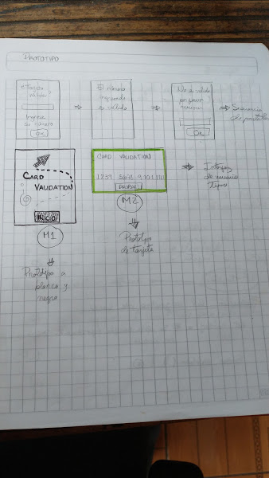
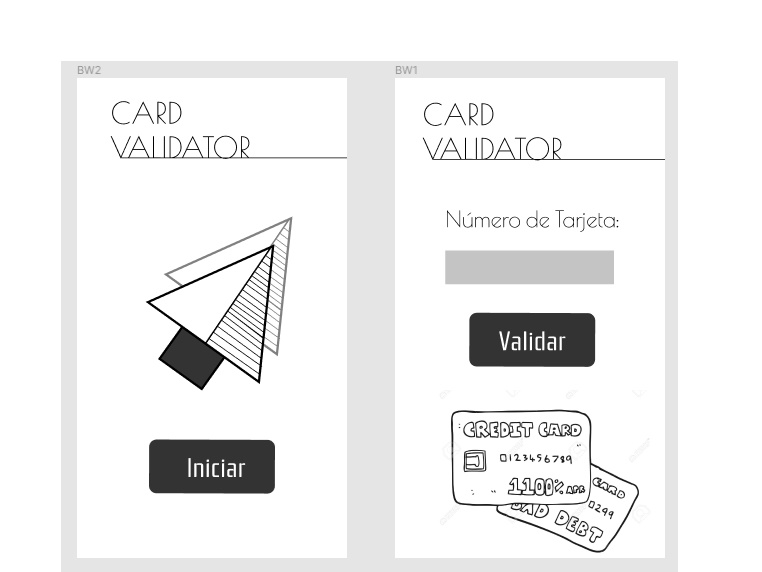
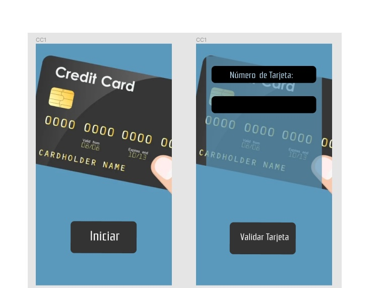
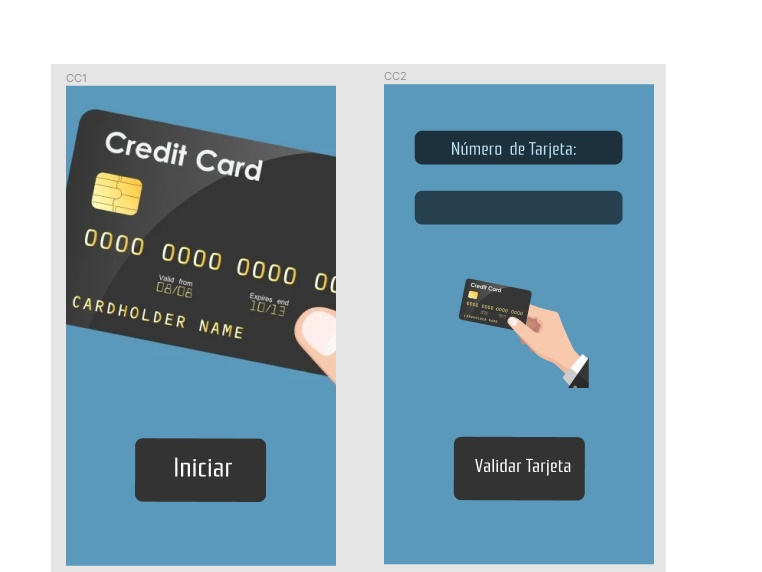
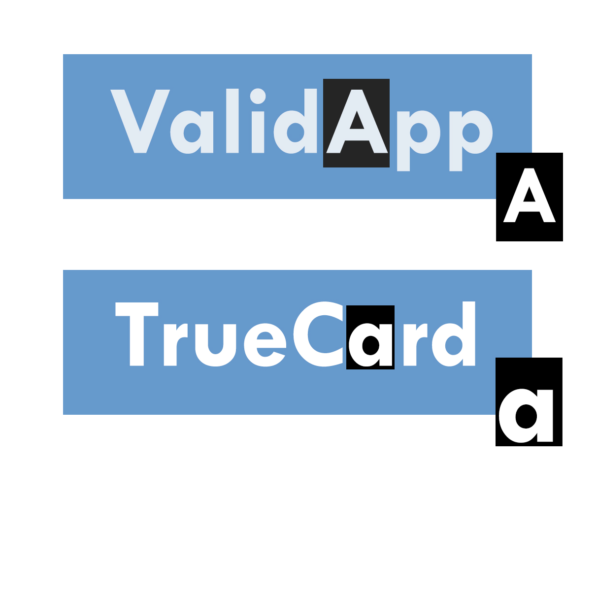
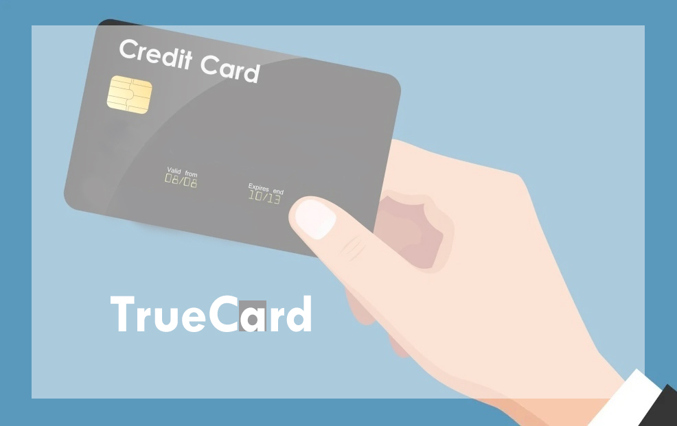
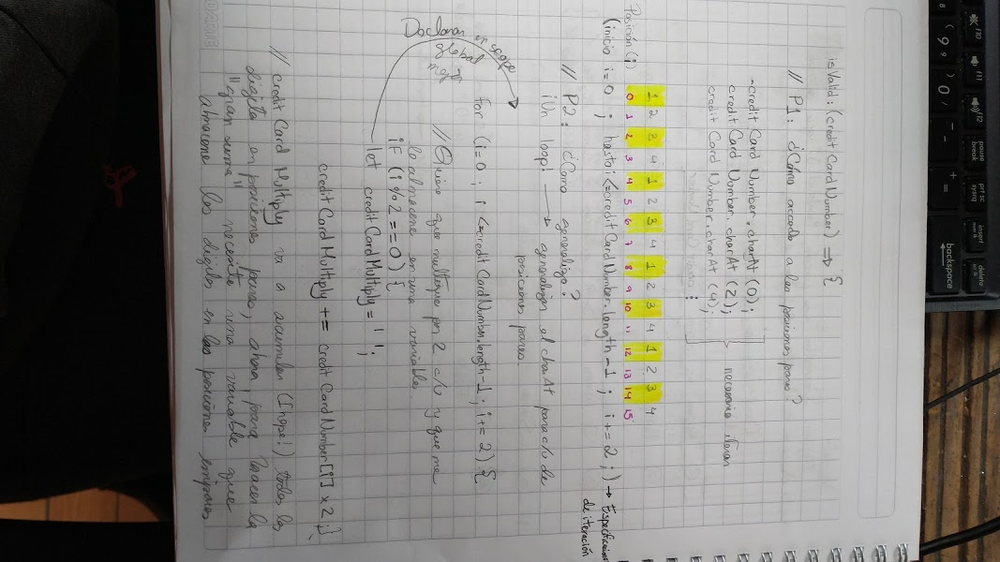
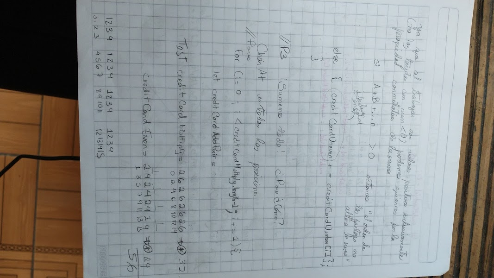
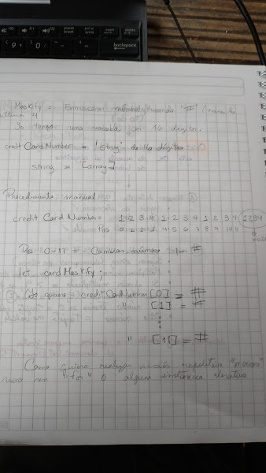
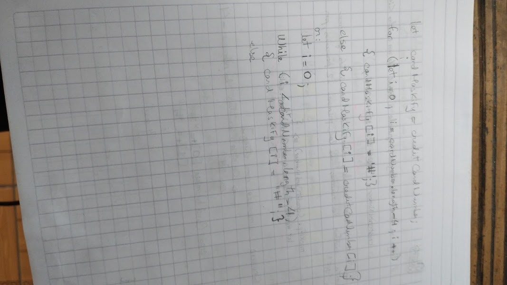

# TrueCard   

## 1. Resumen del proyecto

Se desarrolla aplicación para validación de tarjetas de crédito, pensada como herramienta de apoyo 
para negocios pequeños para el desarrollo de actividades cotidianas, o para ser anexada en página web
(para hacer compras online), como paso previo al proceso de compra..

### 1.1 Definición del producto

* Quiénes son los principales usuarios de producto

Está orientado para facilitar transacciones, y generar un ambiente de pago seguro, para aquellas empresas
pequeñas, o emprendimientos en fase de desarrollo, considerando que por su condición de "pequeña empresa" o pyme, no tienen acceso a sofisticados softwares de seguridad.
Los usuarios son jóvenes adultos - adultos mayores, en edades de productividad (edades 18 - 70).

* Cuáles son los objetivos de estos usuarios en relación con tu producto?

El objetivo del usuario que usa la aplicación es el de corroborar medios de pago, disminuyendo posibilidades
de caer en estafas, detectando a tiempo factores de riesgos.
Esta herramienta les permitirá establecer procesos claros al momento de cerrar un trato con un cliente, transparentando transacciones.

* Cómo crees que el producto que estás creando está resolviendo sus problemas

Cuando se inicia un emprendimiento son muchos los factores de riesgo, en especial si no cuentas con ningún tipo de experiencia en el manejo de negocios.
Este hecho, puede ser aprovechado por personas y organizaciones malintencionadas para sacar provecho de la vulnerabilidad asociada a la inexperiencia.
Las tarjetas de crédito constituyen un método de pago, que pese a todos los beneficios que ofrece al usuario, ha sido tradicionalmente usado como medio de estafas.
Por eso, se desarrolla una herramienta sencilla de implementar (proceso de 2 pasos), el usuario puede incluirla en sus procesos de pago sin ningún tipo de problema, para garantizar transacciones seguras que apoyen el crecimiento de su negocio.

## 2. UX (Diseño de experiencia de usuario)

### Prototipo con papel y lápiz (blanco y negro)
Se desarrolló esquema con ideas para desarrollo de app

### Prototipo de alta fidelidad

### TESTEO

*Link a figma: https://www.figma.com/file/qcqHM9giJucOW7O3Yzw5Rj/Prototipos-testing?node-id=29%3A3

#### Prototipos para testeo:
Se desarrollaron tres modelos, y estos fueron testeados con 10 personas

#### * MODELO A 

#### * MODELO B

#### * MODELO C

#### * TEST NOMBRE APP

Se desarrolloraron dos nombres para la app, y se procedio a testear aceptacion

### RESUMEN FEEDBACK RECIBIDO

* Mantener tamaño de fuente en botones de jerarquía similar.

* Usar blanco para cuadro usado para suavizar imagen en modelo B.

* Tapar numeros en imagen del modelo B (para evitar confusiones)

* Colores claros en recuadro de ingreso de numero de tarjeta.

### PROTOTIPO IMAGEN FINAL
Una vez recibido el feedback sobre los modelos de testeo, se procedio a incluir modificaciones y observaciones obtenidas.
De este proceso nacio el prototipo base sobre el cual se trabajo en este proyecto.

## 3. Interfaz de usuario (UI)

### Insertar el número que queremos validar:

* Usuario escribe numero <input type:'text'>
* Cuando se hace click 'validar' se registra accion a traves de un addEventListener()
* Se escribe funcion asociada al evento click: savingNumber (), esta funcion almacena numero de tarjeta en variable 'creditCardNumber' y ejecuta funcion validator.maskify (para sustituir numeros por '#'). Esta funcion tambien desencadena los mensajes de error asociados al tipo de data ingresada (no 0, no casilla vacia), y a su vez, es la que almacena los mensajes que muestran el resultado de la validacion.

### Ver el resultado si es válido o no

* Se desarrolla planificacion mediante un esquema en papel y lapiz el procedimiento a seguir para completar pasos de algoritmo de Luhn (esta acción facilitó flujo de ideas, y organización de estructuras correctamente).

* Haciendo uso del metodo charAt() se consigue separar los caracteres ingresados por el usuario en variable creditCardNumber. Para generalizar procedimiento, se implementa un loop (for):
        
        creditCardNumber.charAt(0)= digito almacenado en posicion 0;
        creditCardNumber.charAt(1)= digito almacenado en posicion 1;
        ...
        creditCardNumber.chartAt[i]= separacion de cada uno de los digitos usando una estructura ciclica (loop).

* Se genera una nueva variable creditCardStep1, donde se almacenan los valores del ciclo, el cual a traves de condicionales (if- else), multiplica por dos numeros que cumplan la condicion de paridad, y mantiene el mismo valor, en aquellos digitos ubicados en posiciones impares.
 
 CRITERIO PARA DEFINICION DE POSICIONES PARES: 
      Para la seleccion de las posiciones pares,se toma en cuenta el criterio del video de Michelle   (https://www.youtube.com/watch?v=f0zL6Ot9y_w),

      en el que:

              creditCardNumber[0]= posicion 1 (impar)
              creditCardNumber[1]= posicion 2 (par)...

      Por lo tanto cuando se tienen los digitos string en posiciones pares (i=0,2,4,6...i%2===0) en realidad me refiero a digitos en posiciones impares de acuerdo a este criterio

* Para hacer la suma interna, se genera una nueva variable (finalAdittion), y en ella se almacena la suma de cada uno de los digitos (para ello se transforma el string a number [parseInt]). Este procedimiento se desarrolla en un nuevo ciclo 'for', ya que se requiere que la accion se repita 'creditCardStep1.length -1' veces.

* Con una estructura condicional (if- else) se evalua la condicion de validez del algoritmo de Lunh (finalAdittion%10===0).

### Ocultar todos los dígitos de su número de tarjeta menos los últimos 4 caracteres.

* Se planifica en un esquema hecho en papel y lapiz el procedimiento a seguir para completar pasos de algoritmo de Luhn (esta acción facilitó flujo de ideas, y organización de estructuras correctamente).

* Este objetivo se logra mediante la sustitucion de valores en el string inicial (creditCardNumber) por '#' y su almacenamiento en una nueva variable llamada cardMaskify.

* Se escribe ciclo iterativo, para cada una de las posiciones.

* En el interior del ciclo se escribe estructura condicional (if- else). La primera para los primeros digitos de la creditCardNumeber.length -4, y se indica que se realice la sustituci'on por '#'.

* Para los casos que se excluyen de esta condicion (pero que se encuentran dentro de la condicion del ciclo for: creditCardNumber.length-1), se indica que se mantenga el valor numerico.

* Esta funcion se enlaza a la accion del boton validar, mediante un document.getElementById, declarado en el scope de la funcion savingNumber() escrita en index.js.

### No debe poder ingresar un campo vacío

* En el archivo index.js se escriben restricciones asociadas al valor ingresado por el usuario (no '0', no 'null', no < 16 digitos).

* Se trabaja con la estructura condicional while, ya que esta ejecuta la accion indicada hasta que se cumpla la condicion 'true'

